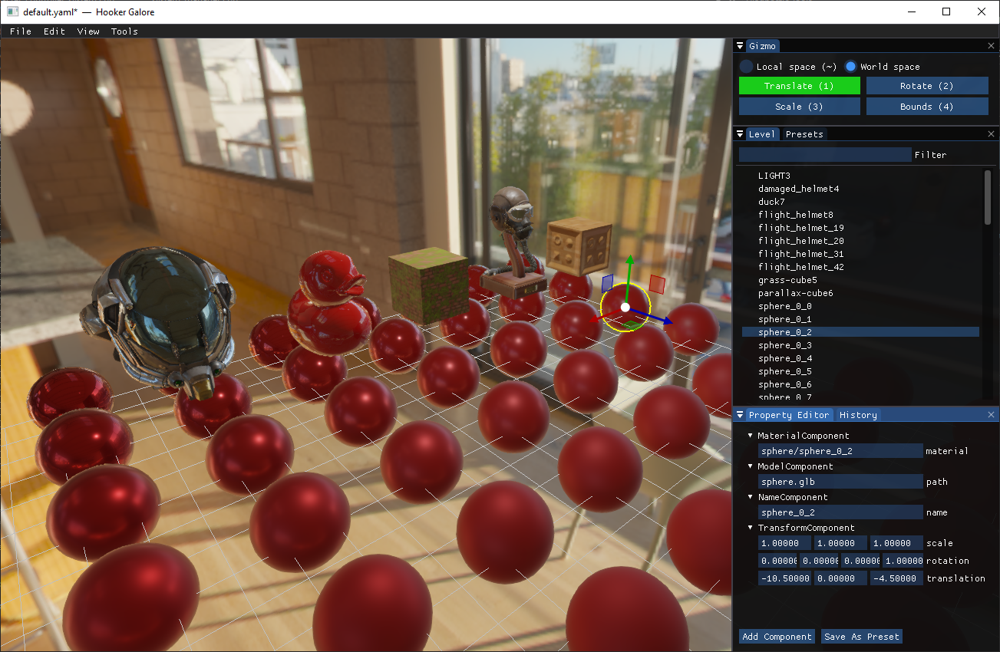
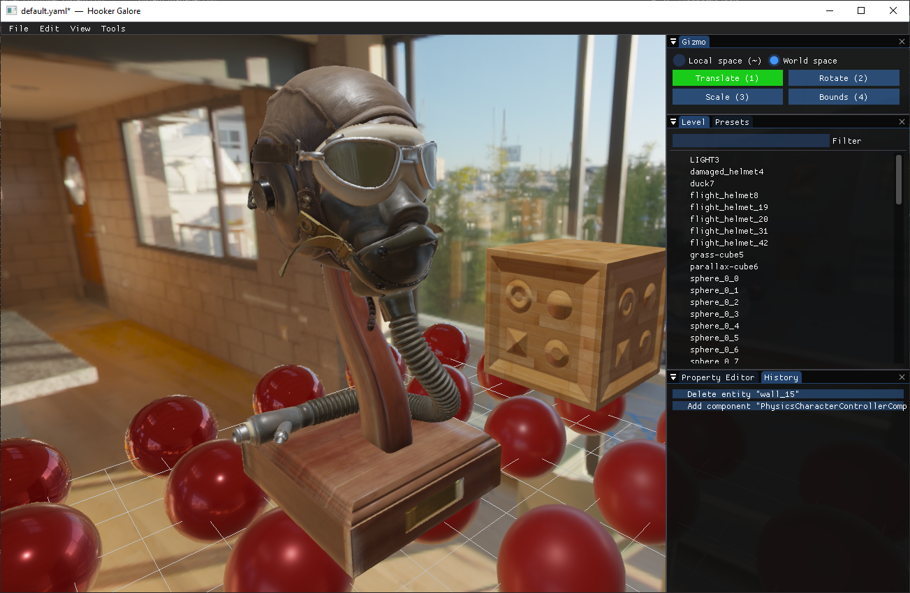
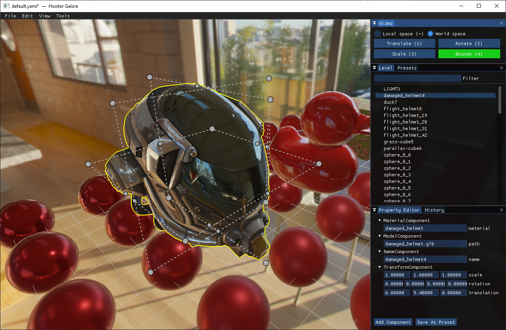
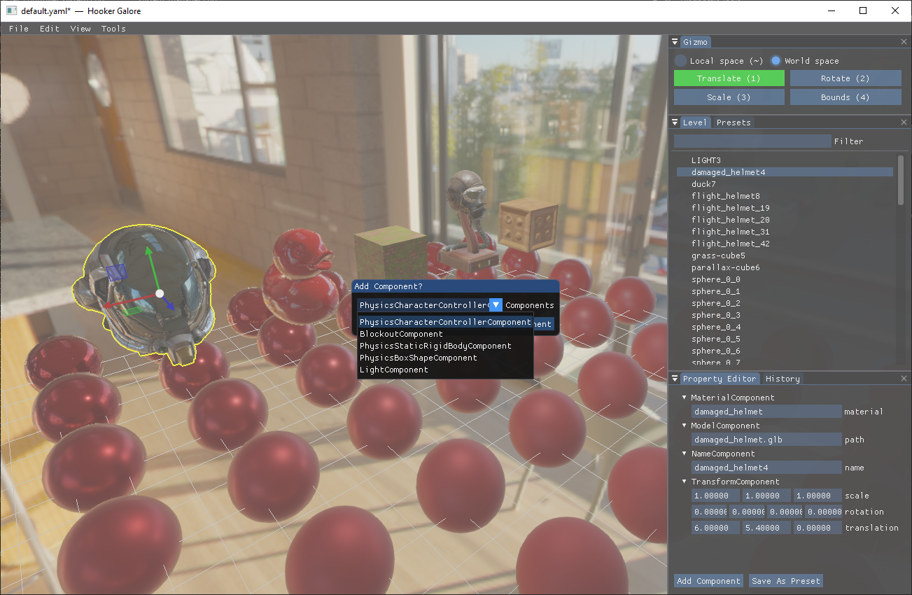

# Hooker Galore


An experimental game engine in which *everything* works through ECS.

For example window is created and managed via `WindowSingleComponent`. `WindowSystem` observes changes to this component and makes corresponding system calls.
Physics simulation is managed via `PhysicsSingleComponent`. `PhysicsInitializationSystem`, `PhysicsSimulateSystem` and `PhysicsFetchSystem` observe changes to this component
and make corresponding physics engine calls.

Supported platforms (via [SDL2](https://www.libsdl.org/)):
1) Windows;
2) Linux;
3) Mac OS.

Supported rendering backends (via [bgfx](https://github.com/bkaradzic/bgfx)):
1) Direct3D 9;
2) Direct3D 11;
3) Direct3D 12;
4) Metal;
5) OpenGL 2.1;
6) OpenGL 3.1+;
7) Vulkan.

## Systems

1) [AAPassSystem](sources/world/render/aa_pass_system.h) — implements an FXAA render pass;
2) [CameraSystem](sources/world/render/camera_system.h) — updates camera matrices (view, projection, inverse view, inverse projection) in `CameraSingleComponent` which are later used by other render systems;
3) [DebugDrawPassSystem](sources/world/render/debug_draw_pass_system.h) — draws debug primitives like points, lines, and glyphs;
4) [EditorCameraSystem](sources/world/editor/editor_camera_system.h) — updates editor cameras;
5) [EditorFileSystem](sources/world/editor/editor_file_system.h) — manages "File" menu operations: new, open, save and save as;
6) [EditorGizmoSystem](sources/world/editor/editor_gizmo_system.h) — shows gizmo that allows modifying transform of selected entity(s);
7) [EditorGridSystem](sources/world/editor/editor_grid_system.h) — draws editor grid using debug draw;
8) [EditorHistorySystem](sources/world/editor/editor_history_system.h) — shows history overlay and performs undo-redo operations;
9) [EditorMenuSystem](sources/world/editor/editor_menu_system.h) — shows editor menu (file, edit, and so on);
10) [EditorPresetSystem](sources/world/editor/editor_preset_system.h) — shows preset overlay, which allows putting preset entities on the stage;
11) [EditorPropertyEditorSystem](sources/world/editor/editor_property_editor_system.h) — shows property editor overlay, which allows to change existing components, add new components, and remove existing components;
12) [EditorSelectionSystem](sources/world/editor/editor_selection_system.h) — shows entities overlay, processes LMB clicks to select entities using the picking pass texture;
13) [GeometryPassSystem](sources/world/render/geometry_pass_system.h) — implements geometry pass for deferred rendering;
14) [HDRPassSystem](sources/world/render/hdr_pass_system.h) — implements an HDR pass;
15) [ImguiFetchSystem](sources/world/imgui/imgui_fetch_system.h) — fetches input and window data to ImGui;
16) [ImguiPassSystem](sources/world/imgui/imgui_pass_system.h) — draws ImGui on the screen;
17) [LightingPassSystem](sources/world/render/lighting_pass_system.h) — implements lighting pass for deferred rendering;
18) [OutlinePassSystem](sources/world/render/outline_pass_system.h) — draws an outline around entities with `OutlineComponent`;
19) [PhysicsCharacterControllerSystem](sources/world/physics/physics_character_controller_system.h) — synchronizes character controller components and PhysX character controllers;
20) [PhysicsFetchSystem](sources/world/physics/physics_fetch_system.h) — waits until the end of asynchronous PhysX simulation and fetches data from it;
21) [PhysicsInitializationSystem](sources/world/physics/physics_initialization_system.h) — initializes PhysX;
22) [PhysicsRigidBodySystem](sources/world/physics/physics_rigid_body_system.h) — synchronizes rigid body components and PhysX rigid bodies;
23) [PhysicsShapeSystem](sources/world/physics/physics_shape_system.h) — synchronizes shape components and PhysX shapes;
24) [PhysicsSimulateSystem](sources/world/physics/physics_simulate_system.h) — starts asynchronous physics simulation;
25) [PickingPassSystem](master/sources/world/render/outline_pass_system.h) — draws all entities with entity indices encoded in color. Asynchronously reads back the resulting texture (used for selection in the editor);
26) [QuadSystem](sources/world/render/quad_system.h) — creates quad geometry and stores it in `QuadSingleComponent`. This quad is used in all screen space render passes;
27) [RenderFetchSystem](sources/world/render/render_fetch_system.h) — prepares rendering backend for rendering;
28) [RenderSystem](sources/world/render/render_system.h) — presents image on the screen;
29) [ResourceSystem](sources/world/shared/resource_system.h) — asynchronously loads all resources (models, textures, and presents);
30) [SkyboxPassSystem](sources/world/render/skybox_pass_system.h) — draws skybox;
31) [WindowSystem](sources/world/shared/window_system.h) — fetches window events, synchronizes `WindowSingleComponent` with an actual window.

## Components

1) [AAPassSingleComponent](sources/world/render/aa_pass_single_component.h) — stores `AAPassSystem` state (such as frame buffer handle, shader program handle, and more);
2) [BlockoutComponent](sources/world/render/blockout_component.h) — makes entity's UV coordinates scale-dependent without changing vertex buffers;
3) [CameraSingleComponent](sources/world/render/camera_single_component.h) — contains a pointer to an active camera and view, projection, inverse view, and inverse projection matrices of that camera;
4) [DebugDrawPassSingleComponent](sources/world/render/debug_draw_pass_single_component.h) — stores `DebugDrawPassSystem` state (such as frame buffer handle, shader program handle, and more);
5) [EditorCameraComponent](sources/world/editor/editor_camera_component.h) — makes an entity a first-person flying camera managed by `EditorCameraSystem`;
6) [EditorFileSingleComponent](sources/world/editor/editor_file_single_component.h) — stores which file menu's dialog window is currently open;
7) [EditorGizmoSingleComponent](sources/world/editor/editor_gizmo_single_component.h) — stores which gizmo operation is currently active, whether it's in local space or in global space;
8) [EditorGridSingleComponent](sources/world/editor/editor_grid_single_component.h) — stores whether editor grid is visible or not;
9) [EditorHistorySingleComponent](sources/world/editor/editor_history_single_component.h) — stores ring buffers of undo-redo actions;
10) [EditorMenuSingleComponent](sources/world/editor/editor_menu_single_component.h) — stores menu items;
11) [EditorPresetSingleComponent](sources/world/editor/editor_preset_single_component.h) — stores all loaded presets;
12) [EditorSelectionSingleComponent](sources/world/editor/editor_selection_single_component.h) — stores which entities are selected;
13) [GeometryPassSingleComponent](sources/world/render/geometry_pass_single_component.h) — stores `GeometryPassSystem` state (such as frame buffer handle, shader program handle, and more);
14) [HDRPassSingleComponent](sources/world/render/hdr_pass_single_component.h) — stores `HDRPassSystem` state (such as frame buffer handle, shader program handle, and more);
15) [ImguiSingleComponent](sources/world/imgui/imgui_single_component.h) — stores ImGui render pass shader programs, textures, and more;
16) [LevelSingleComponent](sources/world/shared/level_single_component.h) — stores which level to load;
17) [LightComponent](sources/world/render/light_component.h) — makes an entity a point light;
18) [LightingPassSingleComponent](sources/world/render/lighting_pass_single_component.h) — stores `LightingPassSystem` state (such as frame buffer handle, shader program handle, and more);
19) [MaterialComponent](sources/world/render/material_component.h) — defines entity's material;
20) [ModelComponent](sources/world/render/model_component.h) — defines entity's geometry;
21) [ModelSingleComponent](sources/world/render/model_single_component.h) — stores all loaded models;
22) [NameComponent](sources/world/shared/name_component.h) — specifies the name of an entity;
23) [NameSingleComponent](sources/world/shared/name_single_component.h) — stores mapping from name to an entity;
24) [NormalInputSingleComponent](sources/world/shared/normal_input_single_component.h) — stores input state;
25) [OutlineComponent](sources/world/render/outline_component.h) — adds an outline to an entity;
26) [OutlinePassSingleComponent](sources/world/render/outline_pass_single_component.h) — stores `OutlinePassSystem` state (such as frame buffer handle, shader program handle, and more);
27) [PhysicsBoxShapeComponent](sources/world/physics/physics_box_shape_component.h) — adds a physical box shape to a rigid body;
28) [PhysicsBoxShapePrivateComponent](sources/world/physics/physics_box_shape_private_component.h) — automatically added and removed by `PhysicsShapeSystem`, stores PhysX shape handle;
29) [PhysicsCharacterControllerComponent](sources/world/physics/physics_character_controller_component.h) — makes an entity a character controller;
30) [PhysicsCharacterControllerPrivateComponent](sources/world/physics/physics_character_controller_private_component.h) — automatically added and removed by `PhysicsCharacterControllerSystem`, stores PhysX character controller handle;
31) [PhysicsCharacterControllerSingleComponent](physics/physics_character_controller_single_component.h) — stores PhysX character controller manager;
32) [PhysicsSingleComponent](sources/world/physics/physics_single_component.h) — stores PhysX handles;
33) [PhysicsStaticRigidBodyComponent](sources/world/physics/physics_static_rigid_body_component.h) — makes an entity a rigid body;
34) [PhysicsStaticRigidBodyPrivateComponent](sources/world/physics/physics_static_rigid_body_private_component.h) — automatically added and removed by `PhysicsRigidBodySystem`, stores PhysX rigid body handle;
35) [PickingPassSingleComponent](sources/world/render/picking_pass_single_component.h) — stores `PickingPassSystem` state (such as frame buffer handle, shader program handle, and more);
36) [QuadSingleComponent](sources/world/render/quad_single_component.h) — stores quad vertex and index buffers;
37) [RenderSingleComponent](sources/world/render/render_single_component.h) — stores current frame and whether to show debug info;
38) [SkyboxPassSingleComponent](sources/world/render/skybox_pass_single_component.h) — stores `SkyboxPassSystem` state (such as frame buffer handle, shader program handle, and more);
39) [TextureSingleComponent](sources/world/render/texture_single_component.h) — stores all loaded textures;
40) [TransformComponent](sources/world/shared/transform_component.h) — stores linear transformation of an entity;
41) [WindowSingleComponent](sources/world/shared/window_single_component.h) — stores window title, width, height, and more.

## System execution order

System execution order is an important topic in every ECS game engine. Initially, this engine had a manual system order,
but after a couple of dozen systems, it has become difficult to add new systems to that list.

Now each system has a small descriptor that defines before/after which systems a certain system must execute.

```cpp
SYSTEM_DESCRIPTOR(
    SYSTEM(LightingPassSystem),
    TAGS(render),
    BEFORE("RenderSystem"),
    AFTER("WindowSystem", "RenderFetchSystem", "CameraSystem", "GeometryPassSystem")
)
```

Tags are used to enable/disable certain systems (like physics or debug).

Fixed system execution order:
1) PhysicsInitializationSystem;
2) PhysicsCharacterControllerSystem;
3) PhysicsRigidBodySystem;
4) PhysicsShapeSystem;
5) PhysicsSimulateSystem;
6) PhysicsFetchSystem.

Normal system execution order:
1) WindowSystem;
2) RenderFetchSystem;
3) ImguiFetchSystem;
4) EditorMenuSystem;
5) EditorSelectionSystem;
6) EditorCameraSystem;
7) CameraSystem;
8) EditorPresetSystem;
9) ResourceSystem;
10) EditorFileSystem;
11) EditorGizmoSystem;
12) EditorPropertyEditorSystem;
13) GeometryPassSystem;
14) LightingPassSystem;
15) SkyboxPassSystem;
16) AAPassSystem;
17) EditorGridSystem;
18) DebugDrawPassSystem;
19) EditorHistorySystem;
20) HDRPassSystem;
21) ImguiPassSystem;
22) OutlinePassSystem;
23) PickingPassSystem;
24) QuadSystem;
25) RenderSystem.

## Screenshots



*Overview of the editor.*



*PBR flight helmet.*



*PBR damaged helmet.*



*Add components dialog window.*
